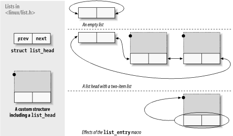

## 11.5. 链表
与许多其他程序一样，操作系统内核通常需要维护数据结构列表。Linux 内核有时会同时托管多个链表实现。为了减少重复代码的数量，内核开发人员创建了一个循环双向链表的标准实现;鼓励其他需要操纵列表的人使用此工具。

使用链表接口时，应始终牢记列表函数不执行锁定。如果驱动程序可能尝试对同一列表执行并发操作，则你有责任实现锁定方案。替代方案（损坏的列表结构、数据丢失、内核崩溃）往往难以诊断。

要使用列表机制，驱动程序必须包含文件 linux/list.h 。此文件定义了 list_head 类型的简单结构：
```c
struct list_head {
    struct list_head *next, *prev;
};
```
实际代码中使用的链表几乎总是由某种类型的结构组成，每个结构描述列表中的一个条目。若要在代码中使用 Linux 列表工具，只需在构成列表的结构中嵌入list_head。例如，如果你的驱动程序维护了一个要做的事情列表，那么它的声明将如下所示：
```c
struct todo_struct {
    struct list_head list;
    int priority; /* driver specific */
    /* ... add other driver-specific fields */
};
```
列表的头部通常是一个独立的list_head结构。图 11-1 显示了如何使用简单的结构list_head来维护数据结构列表。
Figure 11-1. The list_head data structure


在与 INIT_LIST_HEAD 宏一起使用之前，必须初始化列表头。“待办事项”列表头可以用以下命令声明和初始化：
```c
struct list_head todo_list;

INIT_LIST_HEAD(&todo_list);
```
或者，可以在编译时初始化列表：
```c
LIST_HEAD(todo_list);
```
linux/list.h 中定义了几个处理列表的函数：
```c
list_add(struct list_head *new, struct list_head *head);
```
在列表标题之后添加新条目，通常位于列表的开头。因此，它可用于构建堆栈。但请注意，头部不一定是列表的名义头部;如果传递的list_head结构恰好位于列表中间的某个位置，则新条目会紧随其后。由于 Linux 列表是循环的，因此列表的头部通常与任何其他条目没有区别。
```c
list_add_tail(struct list_head *new, struct list_head *head);
```
在给定列表标题之前添加一个新条目，即在列表的末尾。因此，list_add_tail可用于构建先进先出队列。
```c
list_del(struct list_head *entry);
list_del_init(struct list_head *entry);
```
给定条目将从列表中删除。如果该条目可能被重新插入到另一个列表中，则应使用 list_del_init，这将重新初始化链表指针。
```c
list_empty(struct list_head *head);
```
如果给定列表为空，则返回非零值。
```c
list_splice(struct list_head *list, struct list_head *head);
```
通过在 head 后面插入 list 来连接两个列表。

list_head结构适用于实现类似结构的列表，但调用程序通常对构成整个列表的较大结构更感兴趣。list_entry，提供了一个宏，用于将list_head结构指针映射回指向包含该指针的结构的指针。它的调用方式如下：
```c
list_entry(struct list_head *ptr, type_of_struct, field_name);
```
其中 ptr 是指向正在使用的结构list_head的指针，type_of_struct 是包含 ptr 的结构的类型，field_name 是结构中列表字段的名称。在我们之前的todo_struct结构中，列表字段简称为列表。因此，我们将使用如下行将列表条目转换为其包含结构：
```c
struct todo_struct *todo_ptr = list_entry(listptr, struct todo_struct, list);
```
list_entry宏需要一点时间来适应，但并不难使用。

链表的遍历很简单：只需遵循prev和nex指针。例如，假设我们要保持todo_struct项列表按优先级降序排序。添加新条目的函数如下所示：
```c
void todo_add_entry(struct todo_struct *new)
{
    struct list_head *ptr;
    struct todo_struct *entry;

    for (ptr = todo_list.next; ptr != &todo_list; ptr = ptr->next) {
        entry = list_entry(ptr, struct todo_struct, list);
        if (entry->priority < new->priority) {
            list_add_tail(&new->list, ptr);
            return;
        }
    }
    list_add_tail(&new->list, &todo_struct)
}
```
使用提供的宏有助于避免简单的编程错误;这些宏的开发人员也付出了一些努力来确保它们表现良好。存在一些变体：
```c
list_for_each(struct list_head *cursor, struct list_head *list)
```
此宏创建一个 for 循环，该循环执行一次，光标指向列表中的每个连续条目。在循环访问列表时，请小心更改列表。
```c
list_for_each_prev(struct list_head *cursor, struct list_head *list)
```
此版本向后循环访问列表。
```c
list_for_each_safe(struct list_head *cursor, struct list_head *next, struct list_head *list)
```
如果循环可能会删除列表中的条目，请使用此版本。它只是将列表中的下一个条目存储在循环开始时的 next 中，因此如果删除光标指向的条目，它不会感到困惑。
```c
list_for_each_entry(type *cursor, struct list_head *list, member)
list_for_each_entry_safe(type *cursor, type *next, struct list_head *list,member)
```
这些宏简化了处理包含给定类型结构的列表的过程。此处，cursor 是指向包含结构类型的指针，member 是包含结构中list_head结构的名称。使用这些宏，无需将list_entry调用放入循环中。

如果你查看 linux/list.h ，你会看到一些额外的声明。hlist 类型是一个双向链表，具有单独的单指针列表头类型;它通常用于创建哈希表和类似结构。还有一些宏用于遍历这两种类型的列表，旨在与读-复制-更新机制一起使用（在第 5 章的第 5.7.5 节中描述）。这些基元在设备驱动程序中不太可能有用;如果您想了解有关它们工作原理的更多信息，请参阅头文件。