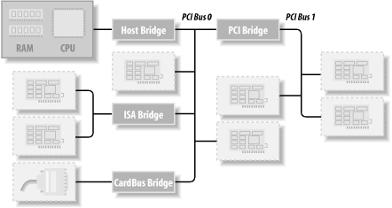
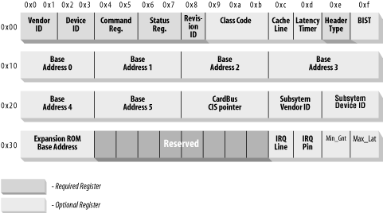

## 12.1. PCI接口
尽管许多计算机用户认为PCI是一种布置电线的方式，但它实际上是一套完整的规范，定义了计算机的不同部分应该如何交互。

PCI规范涵盖了与计算机接口相关的大多数问题。我们不打算在这里一一介绍;在本节中，我们主要关注PCI驱动程序如何找到其硬件并访问它。第 12 章和第 10 章中讨论的探测技术可用于 PCI 设备，但该规范提供了一种优于探测的替代方案。

PCI架构旨在替代ISA标准，其主要目标有三个：在计算机及其外围设备之间传输数据时获得更好的性能，尽可能独立于平台，并简化在系统中添加和删除外围设备的过程。

PCI 总线通过使用比 ISA 更高的时钟速率来实现更好的性能;其时钟运行频率为 25 或 33 MHz（其实际速率是系统时钟的一个因素），最近还部署了 66 MHz 甚至 133 MHz 的实现。此外，它还配备了 32 位数据总线，并且规范中包含了 64 位扩展。平台独立性通常是计算机总线设计中的一个目标，也是PCI的一个特别重要的特性，因为PC世界一直由处理器特定的接口标准主导。PCI 目前广泛用于 IA-32、Alpha、PowerPC、SPARC64 和 IA-64 系统以及其他一些平台。

然而，与驱动程序编写器最相关的是PCI对接口板自动检测的支持。PCI 设备是无跳线的（与大多数较旧的外设不同），并在启动时自动配置。然后，设备驱动程序必须能够访问设备中的配置信息才能完成初始化。无需执行任何探测即可实现此操作。

### 12.1.1. PCI寻址
每个PCI外设都由总线编号、设备编号和功能编号标识。PCI 规范允许单个系统托管多达 256 条总线，但由于 256 条总线对于许多大型系统来说是不够的，因此 Linux 现在支持 PCI 域。每个 PCI 域最多可以托管 256 条总线。每条总线最多可容纳 32 个设备，每个设备可以是具有最多 8 个功能的多功能板（例如带有随附 CD-ROM 驱动器的音频设备）。因此，每个函数都可以在硬件级别通过 16 位地址或密钥进行标识。但是，为 Linux 编写的设备驱动程序不需要处理这些二进制地址，因为它们使用称为 pci_dev 的特定数据结构来作用于设备。

最新的工作站至少具有两条PCI总线。在单个系统中插入多条总线是通过桥接器完成的，桥接器是专用的PCI外设，其任务是连接两条总线。PCI 系统的整体布局是一棵树，其中每条总线都连接到一条上层总线，直到树根处的总线 0。CardBus PC卡系统也通过桥接器连接到PCI系统。典型的 PCI 系统如图 12-1 所示，其中突出显示了各种桥接器。


与 PCI 外设关联的 16 位硬件地址虽然大多隐藏在 struct pci_dev 对象中，但偶尔仍然可见，尤其是在使用设备列表时。其中一种情况是 lspci（pciutils 软件包的一部分，可用于大多数发行版）的输出以及 /proc/pci 和 /proc/bus/pci 中的信息布局。PCI 设备的 sysfs 表示也显示了此寻址方案，并添加了 PCI 域信息。显示硬件地址时，可以显示为两个值（一个 8 位总线号和一个 8 位设备和功能号）、三个值（总线、设备和功能），也可以显示为四个值（域、总线、设备和功能）;所有值通常以十六进制显示。
> 某些体系结构还会在 /proc/pci 和 /proc/bus/pci 文件中显示 PCI 域信息。

例如，/proc/bus/pci/devices 使用单个 16 位字段（以简化解析和排序），而 /proc/bus/busnumber 将地址拆分为三个字段。下面显示了这些地址的显示方式，仅显示输出行的开头：
> lspci | cut -d: -f1-3
> 
> cat /proc/bus/pci/devices | cut -f1
> 
> tree /sys/bus/pci/devices/

所有三个设备列表都按相同的顺序排序，因为 lspci 使用 /proc 文件作为其信息源。以VGA视频控制器为例，0x00a0表示0000：00：14.0，分为域（16位）、总线（8位）、设备（5位）和函数（3位）。

每个外设板的硬件电路回答与三个地址空间有关的查询：内存位置、I/O 端口和配置寄存器。前两个地址空间由同一 PCI 总线上的所有设备共享（即，当您访问内存位置时，该 PCI 总线上的所有设备同时看到总线周期）。另一方面，配置空间利用地理寻址。配置查询一次只处理一个槽，因此它们永远不会发生冲突。

就驱动程序而言，内存和 I/O 区域是通过 inb、readb 等以通常的方式访问的。另一方面，配置事务是通过调用特定的内核函数来访问配置寄存器来执行的。关于中断，每个PCI插槽都有四个中断引脚，每个设备功能都可以使用其中一个，而不必担心这些引脚如何路由到CPU。这种路由由计算机平台负责，并在PCI总线之外实现。由于 PCI 规范要求中断线是可共享的，因此即使是 IRQ 线数量有限的处理器（如 x86）也可以托管许多 PCI 接口板（每个板有四个中断引脚）。

PCI 总线中的 I/O 空间使用 32 位地址总线（导致 4 GB 的 I/O 端口），而内存空间可以使用 32 位或 64 位地址访问。64 位地址在较新的平台上可用。地址对于一个设备应该是唯一的，但软件可能会错误地将两个设备配置为同一地址，从而无法访问任何一个设备。但是，除非驱动工程师愿意使用它不应该触及的寄存器，否则永远不会发生此问题。好消息是，接口板提供的每个内存和I/O地址区域都可以通过配置事务重新映射。也就是说，固件在系统启动时初始化 PCI 硬件，将每个区域映射到不同的地址以避免冲突。可以从配置空间读取这些区域当前映射到的地址，因此 Linux 驱动程序无需探测即可访问其设备。读取配置寄存器后，驱动程序可以安全地访问其硬件。
> 实际上，该配置并不局限于系统启动的时间;例如，热插拔设备在启动时不可用，而是稍后出现。这里的要点是设备驱动程序不得更改 I/O 或内存区域的地址。

PCI 配置空间由每个设备功能的 256 字节组成（PCI Express 设备除外，每个功能有 4 KB 的配置空间），并且配置寄存器的布局是标准化的。配置空间的四个字节包含唯一的函数 ID，因此驱动程序可以通过查找该外围设备的特定 ID 来识别其设备。总之，每个器件板都按地理位置寻址，以检索其配置寄存器;然后，可以使用这些寄存器中的信息来执行正常的 I/O 访问，而无需进一步的地理寻址。
>您可以在其自己的硬件手册中找到任何设备的 ID。pci.ids 文件包含一个列表，它是 pciutils 软件包和内核源代码的一部分;它并不假装完整，而只是列出了最著名的供应商和设备。此文件的内核版本将不会包含在将来的内核系列中。

从这个描述中可以清楚地看出，PCI接口标准在ISA上的主要创新是配置地址空间。因此，除了通常的驱动程序代码外，PCI 驱动程序还需要能够访问配置空间，以便避免有风险的探测任务。

在本章的其余部分，我们使用“设备”一词来指代设备功能，因为多功能板中的每个功能都充当一个独立的实体。当我们提到设备时，我们指的是元组“域号、总线号、设备号和功能号”。

### 12.1.2. 引导时间
要了解PCI的工作原理，我们从系统启动开始，因为这是配置设备的时候。

当 PCI 设备通电时，硬件将保持非活动状态。换言之，设备仅响应配置事务。开机时，设备没有内存，也没有映射在计算机地址空间中的 I/O 端口;所有其他特定于设备的功能（例如中断报告）也被禁用。

幸运的是，每个 PCI 主板都配备了 PCI 感知固件，称为 BIOS、NVRAM 或 PROM，具体取决于平台。固件通过在PCI控制器中读取和写入寄存器来提供对设备配置地址空间的访问。在系统启动时，固件（或 Linux 内核，如果已配置）对每个 PCI 外围设备执行配置事务，以便为其提供的每个地址区域分配一个安全位置。当设备驱动程序访问设备时，其内存和 I/O 区域已映射到处理器的地址空间。驱动程序可以更改此默认分配，但永远不需要这样做。

按照建议，用户可以通过读取 /proc/bus/pci/devices 和 /proc/bus/pci/*/* 来查看 PCI 设备列表和设备的配置寄存器。前者是包含（十六进制）设备信息的文本文件，后者是报告每个设备配置寄存器快照的二进制文件，每个设备一个文件。sysfs 树中的各个 PCI 设备目录位于 /sys/bus/pci/devices 中。.PCI 设备目录包含许多不同的文件：
```
$ tree /sys/bus/pci/devices/0000:00:10.0
/sys/bus/pci/devices/0000:00:10.0
|-- class
|-- config
|-- detach_state
|-- device
|-- irq
|-- power
|   `-- state
|-- resource
|-- subsystem_device
|-- subsystem_vendor
`-- vendor
```
文件配置是一个二进制文件，允许从设备读取原始 PCI 配置信息（就像 /proc/bus/pci/*/* 提供的那样）。文件供应商、设备、subsystem_device、subsystem_vendor和类都引用此 PCI 设备的特定值（所有 PCI 设备都提供此信息）。文件 irq 显示分配给此 PCI 设备的当前 IRQ，文件资源显示此设备分配的当前内存资源。

### 12.1.3. 配置寄存器和初始化
在本节中，我们将了解PCI设备包含的配置寄存器。所有 PCI 设备都至少具有 256 字节的地址空间。前 64 个字节是标准化的，而其余的字节则取决于设备。图 12-2 显示了与设备无关的配置空间的布局。



如图所示，一些PCI配置寄存器是必需的，有些是可选的。每个PCI设备都必须在所需的寄存器中包含有意义的值，而可选寄存器的内容取决于外设的实际功能。除非必填字段的内容表明它们有效，否则不使用可选字段。因此，必填字段断言了开发板的功能，包括其他字段是否可用。

有趣的是，PCI寄存器始终是小端序的。尽管该标准被设计为独立于架构，但PCI设计人员有时会表现出对PC环境的轻微偏见。驱动程序编写器在访问多字节配置寄存器时应注意字节顺序;在 PC 上运行的代码可能无法在其他平台上运行。Linux 开发人员已经解决了字节排序问题（请参阅下一节，第 12.1.8 节），但必须牢记这个问题。如果您需要将数据从主机顺序转换为PCI顺序，反之亦然，则可以求助于第11章中介绍的asm/byteorder.h中定义的函数，因为知道PCI字节顺序是little-endian。

描述所有配置项超出了本书的范围。通常，每个设备发布的技术文档都会描述支持的寄存器。我们感兴趣的是驱动程序如何查找其设备以及如何访问设备的配置空间。

三个或五个 PCI 寄存器标识一个设备：vendorID、deviceID 和 class 是始终使用的三个寄存器。每个 PCI 制造商都为这些只读寄存器分配适当的值，驱动程序可以使用它们来查找设备。此外，供应商有时会设置子系统 vendorID 和子系统 deviceID 字段，以进一步区分类似设备。

让我们更详细地看一下这些寄存器：

__vendorID__ 此 16 位寄存器标识硬件制造商。例如，每个英特尔设备都标有相同的供应商编号，0x8086。PCI特别兴趣小组（PCI Special Interest Group）维护着此类编号的全球注册，制造商必须申请为其分配一个唯一的编号。

__deviceID__ 这是另一个 16 位寄存器，由制造商选择;设备 ID 无需正式注册。此 ID 通常与供应商 ID 配对，为硬件设备创建唯一的 32 位标识符。我们使用“签名”一词来指代供应商和设备 ID 对。设备驱动程序通常依赖于签名来标识其设备;您可以在目标设备的硬件手册中找到要查找的值。

__class__ 每个外围设备都属于一个类。类寄存器是一个 16 位值，其前 8 位标识“基类”（或组）。例如，“ethernet”和“token ring”是属于“network”组的两个类，而“serial”和“parallel”类属于“communication”组。某些驱动程序可以支持多个类似的设备，每个设备都具有不同的签名，但都属于同一类;这些驱动程序可以依靠类寄存器来标识其外围设备，如下所示。

__subsystem vendorID__
__subsystem deviceID__
这些字段可用于进一步识别设备。如果芯片是本地（板载）总线的通用接口芯片，则它通常用于多个完全不同的角色，并且驱动程序必须识别与之通信的实际设备。子系统标识符用于此目的。

使用这些不同的标识符，PCI 驱动程序可以告诉内核它支持哪种设备。struct pci_device_id结构用于定义驱动程序支持的不同类型的 PCI 设备的列表。此结构包含以下字段：

_ _u32 vendor;
_ _u32 device;

它们指定设备的 PCI 供应商和设备 ID。如果驱动程序可以处理任何供应商或设备 ID，则值 PCI_ANY_ID 应用于这些字段。

_ _u32 subvendor;
_ _u32 subdevice;

它们指定设备的 PCI 子系统供应商和子系统设备 ID。如果驱动程序可以处理任何类型的子系统 ID，则值 PCI_ANY_ID 应用于这些字段。

_ _u32 class;
_ _u32 class_mask;

这两个值允许驱动程序指定它支持一种 PCI 类设备。PCI规范中描述了不同类别的PCI设备（VGA控制器就是一个例子）。如果驱动程序可以处理任何类型的子系统 ID，则值 PCI_ANY_ID 应用于这些字段。

kernel_ulong_t driver_data;

此值不用于匹配设备，而是用于保存 PCI 驱动程序可用于区分不同设备（如果需要）的信息。

有两个帮助程序宏应该用于初始化结构pci_device_id结构：

__PCI_DEVICE(vendor, device)__ 这将创建一个仅与特定供应商和设备 ID 匹配的结构pci_device_id。该宏将结构的 subvendor 和 subdevice 字段设置为 PCI_ANY_ID。

__PCI_DEVICE_CLASS(device_class, device_class_mask)__
这将创建一个与特定 PCI 类匹配的结构pci_device_id。

可以使用这些宏来定义驱动程序支持的设备类型的示例可以在以下内核文件中找到：

drivers/usb/host/ehci-hcd.c:
```c
static const struct pci_device_id pci_ids[  ] = { {
        /* handle any USB 2.0 EHCI controller */
        PCI_DEVICE_CLASS(((PCI_CLASS_SERIAL_USB << 8) | 0x20), ~0),
        .driver_data =  (unsigned long) &ehci_driver,
        },
        { /* end: all zeroes */ }
};
```
drivers/i2c/busses/i2c-i810.c:
```c
static struct pci_device_id i810_ids[  ] = {
    { PCI_DEVICE(PCI_VENDOR_ID_INTEL, PCI_DEVICE_ID_INTEL_82810_IG1) },
    { PCI_DEVICE(PCI_VENDOR_ID_INTEL, PCI_DEVICE_ID_INTEL_82810_IG3) },
    { PCI_DEVICE(PCI_VENDOR_ID_INTEL, PCI_DEVICE_ID_INTEL_82810E_IG) },
    { PCI_DEVICE(PCI_VENDOR_ID_INTEL, PCI_DEVICE_ID_INTEL_82815_CGC) },
    { PCI_DEVICE(PCI_VENDOR_ID_INTEL, PCI_DEVICE_ID_INTEL_82845G_IG) },
    { 0, },
};
```
这些示例创建一个结构pci_device_id结构列表，并将空结构设置为全零作为列表中的最后一个值。此 ID 数组用于结构pci_driver （如下所述） ，它还用于告知用户空间此特定驱动程序支持哪些设备。

### 12.1.4. MODULE_DEVICE_TABLE
此pci_device_id结构需要导出到用户空间，以允许热插拔和模块加载系统知道哪个模块适用于哪些硬件设备。宏MODULE_DEVICE_TABLE实现了这一点。例如：
```c
MODULE_DEVICE_TABLE(pci, i810_ids);
```
此语句创建一个名为 _ _mod_pci_device_table 的局部变量，该变量指向结构pci_device_id列表。在内核构建过程的后期，depmod 程序会搜索所有模块中的符号 _ _mod_pci_device_table。如果找到该符号，它会从模块中提取数据并将其添加到文件 /lib/modules/KERNEL_VERSION/modules.pcimap。depmod 完成后，内核中的模块支持的所有 PCI 设备及其模块名称都将在该文件中列出。当内核告诉热插拔系统已找到新的 PCI 设备时，热插拔系统将使用 modules.pcimap 文件查找要加载的正确驱动程序。

### 12.1.5. 注册 PCI 驱动程序
为了正确注册到内核，所有 PCI 驱动程序必须创建的主要结构是结构pci_driver结构。此结构由许多函数回调和变量组成，这些函数回调和变量将 PCI 驱动程序描述为 PCI 内核。以下是 PCI 驱动程序需要注意的此结构中的字段：

__const char *name;__ 驱动程序的名称。它在内核中的所有 PCI 驱动程序中必须是唯一的，并且通常设置为与驱动程序的模块名称相同的名称。当驱动程序在内核中时，它会显示在 sysfs 的 /sys/bus/pci/drivers/ 下。

__const struct pci_device_id *id_table;__ 指向本章前面所述的结构pci_device_id表的指针。

__int (*probe) (struct pci_dev *dev, const struct pci_device_id *id);__ 指向 PCI 驱动程序中的探测功能的指针。指向 PCI 驱动程序中的探测功能的指针。当 PCI 核心具有它认为此驱动程序想要控制的结构pci_dev时，PCI 内核将调用此函数。如果 PCI 驱动程序声明传递给它的结构pci_dev，则它应正确初始化设备并返回 0。如果驱动程序不想声明设备，或者发生错误，则应返回负错误值。有关此功能的更多详细信息将在本章后面部分进行。

__void (*remove) (struct pci_dev *dev);__ 指向从系统中删除结构pci_dev或从内核卸载 PCI 驱动程序时 PCI 内核调用的函数的指针。有关此功能的更多详细信息将在本章后面部分进行。

__int (*suspend) (struct pci_dev *dev, u32 state);__ 指向 PCI 内核在结构pci_dev挂起时调用的函数的指针。挂起状态在状态变量中传递。此功能是可选的;驱动程序不必提供它。

__int (*resume) (struct pci_dev *dev);__ 指向 PCI 内核在恢复结构pci_dev时调用的函数的指针。它始终在调用挂起后调用。此功能是可选的;驱动程序不必提供它。

总之，要创建适当的结构pci_driver结构，只需要初始化四个字段：
```c
static struct pci_driver pci_driver = {
    .name = "pci_skel",
    .id_table = ids,
    .probe = probe,
    .remove = remove,
};
```
若要向 PCI 内核注册结构pci_driver，请使用指向结构pci_driver的指针调用 pci_register_driver。传统上，这是在 PCI 驱动程序的模块初始化代码中完成的：
```c
static int _ _init pci_skel_init(void)
{
    return pci_register_driver(&pci_driver);
}
```
请注意，如果所有内容都已成功注册，则 pci_register_driver 函数返回负错误号或 0。它不会返回绑定到驱动程序的设备数，如果没有设备绑定到驱动程序，则返回错误号。这是对 2.6 版本之前内核的更改，由于以下情况而完成：
- 在支持 PCI 热插拔或 CardBus 系统的系统上，PCI 设备可以在任何时间点出现或消失。如果可以在设备出现之前加载驱动程序，以减少初始化设备所需的时间，这将很有帮助。
- 2.6 内核允许在加载驱动程序后将新的 PCI ID 动态分配给驱动程序。这是通过在 sysfs 的所有 PCI 驱动程序目录中创建的文件new_id完成的。如果正在使用内核还不知道的新设备，这将非常有用。用户可以将 PCI ID 值写入new_id文件，然后驱动程序绑定到新设备。如果在系统中存在设备之前不允许加载驱动程序，则此接口将无法工作。

当要卸载 PCI 驱动程序时，需要从内核中取消注册结构pci_driver。这是通过调用 pci_unregister_driver 来完成的。发生此调用时，将删除当前绑定到此驱动程序的任何 PCI 设备，并在 pci_unregister_driver 函数返回之前调用此 PCI 驱动程序的删除函数。
```c
static void _ _exit pci_skel_exit(void)
{
    pci_unregister_driver(&pci_driver);
}
```
### 12.1.6. 旧式PCI探测
在较旧的内核版本中，PCI 驱动程序并不总是使用该函数 pci_register_driver。相反，他们要么手动浏览系统中的 PCI 设备列表，要么调用可以搜索特定 PCI 设备的函数。已从 2.6 内核中删除了在驱动程序中遍历系统中 PCI 设备列表的功能，以防止驱动程序在同时删除设备时碰巧修改 PCI 设备列表时导致内核崩溃。

如果确实需要查找特定 PCI 设备的能力，可以使用以下功能：
```c
struct pci_dev *pci_get_device(unsigned int vendor, unsigned int device,struct pci_dev *from);
```

此函数扫描系统中当前存在的 PCI 设备列表，如果输入参数与指定的供应商和设备 ID 匹配，则会增加找到的结构pci_dev变量的引用计数，并将其返回给调用方。这样可以防止结构在没有任何通知的情况下消失，并确保内核不会发出哎呀声。驱动程序使用完函数返回的结构pci_dev后，它必须调用函数pci_dev_put以正确减少使用计数，以允许内核在删除设备时清理设备。

from 参数用于获取具有相同签名的多个设备;该参数应指向已找到的最后一个设备，以便搜索可以继续，而不是从列表的头部重新启动。若要查找第一个设备，请将 from 指定为 NULL。如果未找到（进一步）设备，则返回 NULL。

如何正确使用此函数的示例如下：
```c
struct pci_dev *dev;
dev = pci_get_device(PCI_VENDOR_FOO, PCI_DEVICE_FOO, NULL);
if (dev) {
    /* Use the PCI device */
    ...
    pci_dev_put(dev);
}
```
此函数不能从中断上下文调用。如果是，则会在系统日志中输出警告。
```c
struct pci_dev *pci_get_subsys(unsigned int vendor, unsigned int device,unsigned int ss_vendor, unsigned int ss_device, struct pci_dev *from);
```
此函数的工作方式与pci_get_device类似，但它允许在查找设备时指定子系统供应商和子系统设备 ID。

此函数不能从中断上下文调用。如果是，则会在系统日志中输出警告。
```c
struct pci_dev *pci_get_slot(struct pci_bus *bus, unsigned int devfn);
```
此函数在指定的结构pci_bus上搜索系统中的 PCI 设备列表，以查找 PCI 设备的指定设备和功能编号。如果找到匹配的设备，则其引用计数将递增，并返回指向该设备的指针。调用方完成对结构pci_dev的访问后，必须调用 pci_dev_put。

所有这些函数都不能从中断上下文中调用。如果是，则会在系统日志中输出警告。

### 12.1.7. 使能PCI设备
在 PCI 驱动程序的探测函数中，在驱动程序可以访问 PCI 设备的任何设备资源 （I/O 区域或中断） 之前，驱动程序必须调用 pci_enable_device 函数：
```c
int pci_enable_device(struct pci_dev *dev);
```
此功能实际上启用了设备。它会唤醒设备，在某些情况下还会分配其中断线和 I/O 区域。例如，CardBus 设备（在驱动程序级别已完全等同于 PCI）中就会发生这种情况。

### 12.1.8. 访问配置空间
驱动程序检测到设备后，通常需要读取或写入三个地址空间：内存、端口和配置。具体而言，访问配置空间对驱动程序至关重要，因为这是它找出设备在内存和 I/O 空间中的映射位置的唯一方法。

由于微处理器无法直接访问配置空间，因此计算机供应商必须提供一种方法来执行此操作。要访问配置空间，CPU 必须在 PCI 控制器中写入和读取寄存器，但确切的实现取决于供应商，与本讨论无关，因为 Linux 提供了一个标准接口来访问配置空间。

就驱动程序而言，可以通过 8 位、16 位或 32 位数据传输来访问配置空间。相关函数原型在 linux/pci.h 中：
```c
int pci_read_config_byte(struct pci_dev *dev, int where, u8 *val);
int pci_read_config_word(struct pci_dev *dev, int where, u16 *val);
int pci_read_config_dword(struct pci_dev *dev, int where, u32 *val);
```
从 dev 标识的设备的配置空间中读取 1 个、2 个或 4 个字节。where 参数是与配置空间开头的字节偏移量。从配置空间获取的值通过 val 指针返回，函数的返回值为错误码。word 和 dword 函数将刚刚读取的值从小端字节序转换为处理器的本机字节顺序，因此您无需处理字节顺序。
```c
int pci_write_config_byte(struct pci_dev *dev, int where, u8 val);
int pci_write_config_word(struct pci_dev *dev, int where, u16 val);
int pci_write_config_dword(struct pci_dev *dev, int where, u32 val);
```
将 1、2 或 4 个字节写入配置空间。设备照常由 dev 标识，写入的值作为 val 传递。word 和 dword 函数在写入外围设备之前将值转换为 little-endian。

前面的所有函数都作为内联函数实现，这些函数实际上调用以下函数。请随意使用这些函数而不是上述函数，以防驱动程序在任何特定时刻都无法访问结构pci_dev：
```c
int pci_bus_read_config_byte (struct pci_bus *bus, unsigned int devfn, int where, u8 *val);
int pci_bus_read_config_word (struct pci_bus *bus, unsigned int devfn, int where, u16 *val);
int pci_bus_read_config_dword (struct pci_bus *bus, unsigned int devfn, int where, u32 *val);
```
就像 pci_read_ 函数一样，但需要 struct pci_bus * 和 devfn 变量，而不是 struct pci_dev *。
```c
int pci_bus_write_config_byte (struct pci_bus *bus, unsigned int devfn, int where, u8 val);
int pci_bus_write_config_word (struct pci_bus *bus, unsigned int devfn, int where, u16 val);
int pci_bus_write_config_dword (struct pci_bus *bus, unsigned int devfn, int where, u32 val);
```
就像 pci_write_ 函数一样，但需要 struct pci_bus * 和 devfn 变量，而不是 struct pci_dev *。

使用 pci_read_ 函数处理配置变量的最佳方法是使用 linux/pci.h 中定义的符号名称。例如，以下小函数通过传递要pci_read_config_byte位置的符号名称来检索设备的修订 ID：
```c
static unsigned char skel_get_revision(struct pci_dev *dev)
{
    u8 revision;

    pci_read_config_byte(dev, PCI_REVISION_ID, &revision);
    return revision;
}
```

### 12.1.9. 访问 I/O 和内存空间
PCI 设备最多实现 6 个 I/O 地址区域。每个区域都由内存或 I/O 位置组成。大多数设备在内存区域中实现其 I/O 寄存器，因为这通常是一种更合理的方法。但是，与普通内存不同，I/O 寄存器不应由 CPU 缓存，因为每次访问都可能产生副作用。将 I/O 寄存器实现为内存区域的 PCI 设备通过在其配置寄存器中设置“memory-is-prefetchable”位来标记差异。如果内存区域被标记为可预取，则 CPU 可以缓存其内容并对其进行各种优化;另一方面，无法优化不可预取的内存访问，因为每次访问都可能产生副作用，就像 I/O 端口一样。将其控制寄存器映射到内存地址范围的外设将该范围声明为不可预取，而PCI板上的视频内存等是可预取的。在本节中，我们使用“区域”一词来指代内存映射或端口映射的通用 I/O 地址空间。
> 该信息位于基址PCI寄存器的低位之一中。这些位在 linux/pci.h 中定义。

接口板使用配置寄存器（图 12-2 中所示的 6 个 32 位寄存器）报告其区域的大小和当前位置，其符号名称PCI_BASE_ADDRESS_0 到 PCI_BASE_ADDRESS_5。由于 PCI 定义的 I/O 空间是 32 位地址空间，因此对内存和 I/O 使用相同的配置接口是有意义的。如果设备使用 64 位地址总线，则可以通过为每个区域使用两个连续的PCI_BASE_ADDRESS寄存器（首先是低位）来声明 64 位内存空间中的区域。一台设备可以同时提供 32 位区域和 64 位区域。

在内核中，PCI 设备的 I/O 区域已集成到通用资源管理中。因此，无需访问配置变量即可了解设备在内存或 I/O 空间中的映射位置。用于获取区域信息的首选接口由以下函数组成：
```c
unsigned long pci_resource_start(struct pci_dev *dev, int bar);
```
该函数返回与六个 PCI I/O 区域之一关联的第一个地址（内存地址或 I/O 端口号）。区域由整数条（基址寄存器）选择，范围为 0-5（含）。
```c
unsigned long pci_resource_end(struct pci_dev *dev, int bar);
```
该函数返回作为 I/O 区域编号栏一部分的最后一个地址。请注意，这是最后一个可用地址，而不是区域之后的第一个地址。
```c
unsigned long pci_resource_flags(struct pci_dev *dev, int bar);
```
此函数返回与此资源关联的标志。

资源标志用于定义单个资源的某些功能。对于与 PCI I/O 区域关联的 PCI 资源，信息是从基址寄存器中提取的，但对于与 PCI 设备无关的资源，信息可能来自其他位置。

所有资源标志都在 linux/ioport.h 中定义;最重要的是：

__IORESOURCE_IO__
__IORESOURCE_MEM__
如果关联的 I/O 区域存在，则仅设置其中一个标志。

__IORESOURCE_PREFETCH__
__IORESOURCE_READONLY__
这些标志指示内存区域是否可预取和/或写保护。从不为 PCI 资源设置后一个标志。

### 12.1.10. PCI中断
就中断而言，PCI易于处理。当Linux启动时，计算机的固件已经为设备分配了一个唯一的中断号，驱动程序只需要使用它即可。中断号存储在配置寄存器 60 (PCI_INTERRUPT_LINE) 中，该寄存器为一字节宽。这允许多达 256 个中断线，但实际限制取决于所使用的 CPU。驱动程序不需要费心检查中断号，因为在 PCI_INTERRUPT_LINE 中找到的值保证是正确的。

如果设备不支持中断，则寄存器61（PCI_INTERRUPT_PIN）为0；否则，它是非零的。然而，由于驱动程序知道其设备是否是中断驱动的，因此通常不需要读取 PCI_INTERRUPT_PIN。

因此，处理中断的 PCI 专用代码只需要读取配置字节即可获取保存在局部变量中的中断号，如下代码所示。除此之外，第 10 章中的信息也适用。
```c
result = pci_read_config_byte(dev, PCI_INTERRUPT_LINE, &myirq);
if (result) {
    /* deal with error */
}
```

本节的其余部分为好奇的读者提供了附加信息，但编写驱动程序不需要这些信息。

PCI 连接器有四个中断引脚，外围板可以使用其中任何一个或全部中断引脚。每个引脚都单独路由到主板的中断控制器，因此可以共享中断，而不会出现任何电气问题。然后，中断控制器负责将中断线（引脚）映射到处理器的硬件；这种与平台相关的操作留给控制器，以实现总线本身的平台独立性。

位于 PCI_INTERRUPT_PIN 的只读配置寄存器用于告诉计算机实际使用哪个引脚。值得记住的是，每个设备板最多可以托管八个设备；每个设备使用单个中断引脚并在其自己的配置寄存器中报告它。同一设备板上的不同设备可以使用不同的中断引脚或共享相同的中断引脚。

另一方面，PCI_INTERRUPT_LINE 寄存器是读/写的。当计算机启动时，固件会扫描其 PCI 设备，并根据 PCI 插槽的中断引脚路由方式设置每个设备的寄存器。该值由固件分配，因为只有固件知道主板如何将不同的中断引脚路由到处理器。然而，对于设备驱动程序，PCI_INTERRUPT_LINE 寄存器是只读的。有趣的是，最新版本的 Linux 内核在某些情况下可以分配中断线，而无需求助于 BIOS。

### 12.1.11. 硬件抽象
我们通过快速浏览一下系统如何处理市场上提供的大量 PCI 控制器来完成对 PCI 的讨论。   这只是一个信息部分，旨在向好奇的读者展示内核的面向对象布局如何向下延伸到最低级别。

用于实现硬件抽象的机制是包含方法的常见结构。这是一种强大的技术，仅将取消引用指针的最小开销添加到函数调用的正常开销中。在 PCI 管理的情况下，唯一依赖于硬件的操作是读写配置寄存器，因为 PCI 世​​界中的其他操作都是通过直接读写 I/O 和内存地址空间来完成的，而这些都在直接控制CPU。

因此，配置寄存器访问的相关结构仅包括两个字段：

```c
struct pci_ops {
    int (*read)(struct pci_bus *bus, unsigned int devfn, int where, int size, u32 *val);
    int (*write)(struct pci_bus *bus, unsigned int devfn, int where, int size, u32 val);
};
```
该结构在 linux/pci.h 中定义，并由 drivers/pci/pci.c 使用，其中定义了实际的公共函数。

作用于 PCI 配置空间的两个函数比取消引用指针有更多的开销；由于代码的高度面向对象，它们使用级联指针，但在很少执行且从未在速度关键路径中执行的操作中，开销不是问题。例如，pci_read_config_byte（dev， where， val） 的实际实现扩展到：
```
dev->bus->ops->read(bus, devfn, where, 8, val);
```

系统中的各种 PCI 总线在系统启动时被检测到，这时会创建结构pci_bus项并将其与其功能（包括 ops 字段）相关联。

通过“硬件操作”数据结构实现硬件抽象是 Linux 内核中的典型做法。一个重要的例子是结构alpha_machine_vector数据结构。它在 asm-alpha/machvec.h 中定义，负责处理不同基于 Alpha 的计算机之间可能发生的所有变化。
