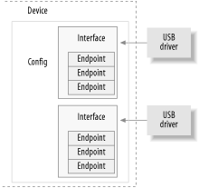

USB 设备是一个非常复杂的东西，如官方 USB 文档（可在 http://www.usb.org 上获得）中所述。幸运的是，Linux 内核提供了一个称为 USB 内核的子系统来处理大部分复杂性。本章介绍驱动程序和 USB 内核之间的交互。图 13-1 显示了 USB 设备如何由配置、接口和终结点组成，以及 USB 驱动程序如何绑定到 USB 接口，而不是整个 USB 设备。


### 13.1.1. 端点
USB 通信的最基本形式是通过称为端点的东西。USB 终结点只能在一个方向上传输数据，即从主机到设备（称为 OUT 终结点）或从设备到主机（称为 IN 终结点）。端点可以看作是单向管道。

USB 终结点可以是描述数据传输方式的四种不同类型之一：

__CONTROL__ 
控制端点用于允许访问 USB 设备的不同部分。它们通常用于配置设备、检索有关设备的信息、向设备发送命令或检索有关设备的状态报告。这些端点通常很小。每个 USB 设备都有一个名为“endpoint0”的控制终结点，USB 内核使用该终结点在插入时配置设备。USB 协议保证这些传输始终具有足够的保留带宽来直通设备。

__INTERRUPT__
每次 USB 主机向设备请求数据时，中断端点都会以固定速率传输少量数据。这些端点是 USB 键盘和鼠标的主要传输方法。它们也通常用于向 USB 设备发送数据以控制设备，但通常不用于传输大量数据。USB 协议保证这些传输始终具有足够的预留带宽来通过。

__BULK__ 
批量终结点传输大量数据。这些端点通常比中断端点大得多（它们可以同时容纳更多字符）。对于需要传输任何数据的设备来说，它们很常见，这些数据必须在没有数据丢失的情况下通过。USB 协议不保证这些传输始终在特定时间内通过。如果总线上没有足够的空间来发送整个 BULK 数据包，则该数据包将拆分为与设备之间的多个传输。这些终结点在打印机、存储和网络设备上很常见。

__ISOCHRONOUS__
常时等量终结点也会传输大量数据，但并不总是保证数据能够通过。这些端点用于可以处理数据丢失的设备，并且更多地依赖于保持恒定的数据流。实时数据收集（如音频和视频设备）几乎总是使用这些终结点。

每当驱动程序决定使用控制和批量终结点时，它们都用于异步数据传输。中断和常时等量终结点是周期性的。这意味着这些端点设置为在固定时间连续传输数据，这会导致 USB 内核保留其带宽。

USB 端点在内核中使用结构结构 usb_host_endpoint 进行描述。此结构在另一个称为 struct usb_endpoint_descriptor 的结构中包含真正的终结点信息。后一种结构包含所有特定于 USB 的数据，其格式与设备本身指定的格式完全相同。驱动程序关心的此结构的字段包括：

__bEndpointAddress__
这是此特定终结点的 USB 地址。此 8 位值中还包括端点的方向。可以将位掩码 USB_DIR_OUT 和 USB_DIR_IN 放置在此字段，以确定此终结点的数据是定向到设备还是主机。

__bmAttributes__
这是终结点的类型。应针对此值放置位掩码USB_ENDPOINT_XFERTYPE_MASK，以确定终结点的类型是 USB_ENDPOINT_XFER_ISOC、USB_ENDPOINT_XFER_BULK 还是 USB_ENDPOINT_XFER_INT 类型。这些宏分别定义常时等量、批量和中断终结点。

__wMaxPacketSize__
这是此终结点一次可以处理的最大大小（以字节为单位）。请注意，驱动程序可以将大量数据发送到大于此值的终结点，但在实际传输到设备时，数据将被划分为 wMaxPacketSize 区块。对于高速设备，此字段可用于通过在值的上部使用几个额外的位来支持终结点的高带宽模式。有关如何执行此操作的更多详细信息，请参阅 USB 规范。

__bInterval__
如果此终结点的类型为 interrupt，则此值是终结点的间隔设置，即终结点的中断请求之间的时间间隔。该值以毫秒为单位表示。

此结构的字段没有“传统”Linux 内核命名方案。这是因为这些字段直接对应于 USB 规范中的字段名称。USB 内核程序员认为，使用指定的名称比使用 Linux 程序员看起来很熟悉的变量名称更重要，这样可以减少阅读规范时的混淆。

### 13.1.2. 接口
USB 端点捆绑到接口中。USB 接口仅处理一种类型的 USB 逻辑连接，例如鼠标、键盘或音频流。某些 USB 设备具有多个接口，例如可能由两个接口组成的 USB 扬声器：用于按钮的 USB 键盘和 USB 音频流。由于 USB 接口表示基本功能，因此每个 USB 驱动程序都控制一个接口;因此，对于扬声器示例，Linux 需要为一个硬件设备提供两个不同的驱动程序。


USB 接口可能具有备用设置，这些设置是接口参数的不同选择。接口的初始状态在第一个设置中，编号为 0。备用设置可用于以不同的方式控制各个终结点，例如为设备保留不同数量的 USB 带宽。每个具有常时等量终结点的设备都对同一接口使用备用设置。

USB 接口在内核中使用 struct usb_interface 结构进行描述。此结构是 USB 内核传递给 USB 驱动程序的内容，也是 USB 驱动程序负责控制的内容。此结构中的重要字段包括：

```c
struct usb_host_interface *altsetting
```
接口结构数组，包含可为此接口选择的所有备用设置。每个结构usb_host_interface都由一组终结点配置组成，如上所述的结构usb_host_endpoint结构所定义。请注意，这些接口结构没有特定的顺序。

```c
unsigned num_altsetting
```
altsetting 指针指向的备用设置数。
```c
struct usb_host_interface *cur_altsetting
```
指向数组 altsetting 的指针，表示此接口的当前活动设置。

```c
int minor
```
如果绑定到此接口的 USB 驱动程序使用 USB 主编号，则此变量包含 USB 内核分配给接口的次要编号。这仅在成功调用 usb_register_dev 后才有效（本章稍后将介绍）。

结构usb_interface结构中还有其他字段，但 USB 驱动程序不需要识别它们。

### 13.1.3. 配置
USB 接口本身捆绑到配置中。USB 设备可以有多种配置，并且可以在它们之间切换以更改设备的状态。例如，一些允许下载固件的设备包含多种配置来完成此操作。单一配置只能在一个时间点启用。Linux 不能很好地处理多个配置 USB 设备，但幸运的是，它们很少见。

Linux 使用结构体 struct usb_host_config 描述 USB 配置，使用结构体 struct usb_device 描述整个 USB 设备。USB 设备驱动程序通常不需要读取或写入这些结构中的任何值，因此此处不对它们进行详细定义。好奇的读者可以在内核源代码树的 include/linux/usb.h 文件中找到它们的描述。

USB 设备驱动程序通常必须将给定 struct usb_interface 结构中的数据转换为 USB 内核进行各种函数调用所需的 struct usb_device 结构。为此，提供了函数interface_to_usbdev。希望将来所有当前需要 struct usb_device 的 USB 调用都将转换为采用 struct usb_interface 参数，并且不需要驱动程序进行转换。

总而言之，USB 设备非常复杂，由许多不同的逻辑单元组成。这些单元之间的关系可以简单描述如下：

- 设备通常具有一种或多种配置。
- 配置通常具有一个或多个接口。
- 界面通常具有一项或多项设置。
- 接口有零个或多个端点。
