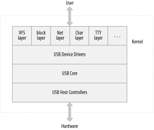

通用串行总线 （USB） 是主机和许多外围设备之间的连接。它最初是为了用所有设备都可以连接的单一总线类型替换各种慢速和不同的总线（并行、串行和键盘连接）而创建的。USB 已经超越了这些缓慢的连接，现在支持几乎所有可以连接到 PC 的设备类型。最新修订的 USB 规范增加了理论速度限制为 480 MBps 的高速连接。

> 本章的部分内容基于 Linux 内核 USB 代码的内核内文档，这些文档由内核 USB 开发人员编写，并在 GPL 下发布。

从拓扑上看，USB 子系统不是作为总线布置的;它更像是一棵由几个点对点链接构建的树。链路是连接设备和集线器的四线电缆（接地线、电源线和两根信号线），就像双绞线以太网一样。USB 主机控制器负责询问每个 USB 设备是否有任何要发送的数据。由于这种拓扑，USB 设备在主机控制器没有先请求的情况下永远无法开始发送数据。这种配置允许一个非常简单的即插即用类型的系统，从而可以由主机自动配置设备。

总线在技术层面上非常简单，因为它是单主实现，其中主机轮询各种外围设备。尽管存在这种固有的限制，但总线仍具有一些有趣的功能，例如设备能够为其数据传输请求固定带宽，以便可靠地支持视频和音频 I/O。USB 的另一个重要特性是，它仅充当设备和主机之间的通信通道，而不需要对其提供的数据具有特定的含义或结构。

>实际上，有一些结构是存在的，但它主要简化为对通信的要求，以适应几个预定义的类之一：例如，键盘不会分配带宽，而某些摄像机会。

USB 协议规范定义了一组标准，任何特定类型的设备都可以遵循这些标准。如果设备遵循该标准，则不需要该设备的特殊驱动程序。这些不同的类型称为类，由存储设备、键盘、鼠标、操纵杆、网络设备和调制解调器等组成。不适合这些类的其他类型的设备需要为该特定设备编写特定于供应商的特殊驱动程序。视频设备和 USB 转串行设备就是一个很好的示例，其中没有定义的标准，来自不同制造商的每个不同设备都需要驱动程序。

这些特性，加上设计固有的热插拔功能，使 USB 成为一种方便、低成本的机制，无需关闭系统、打开盖子和对螺丝和电线发誓即可将多个设备连接（和断开）到计算机。

Linux 内核支持两种主要类型的 USB 驱动程序：主机系统上的驱动程序和设备上的驱动程序。主机系统的 USB 驱动程序从主机的角度控制插入其中的 USB 设备（常见的 USB 主机是台式计算机）。设备中的 USB 驱动程序控制该单个设备作为 USB 设备在主机中的外观。由于术语“USB 设备驱动程序”非常令人困惑，因此 USB 开发人员创建了术语“USB  gadget驱动程序”来描述控制连接到计算机的 USB 设备的驱动程序（请记住，Linux 也运行在这些微型嵌入式设备中)。本章详细介绍了在台式计算机上运行的 USB 系统的工作原理。目前，USB 小工具驱动程序不在本书的范围内。

如第 13 章所示，USB 驱动程序位于不同的内核子系统（块、网络、字符等）和 USB 硬件控制器之间。USB 内核为 USB 驱动程序提供了一个接口，用于访问和控制 USB 硬件，而无需担心系统上存在的不同类型的 USB 硬件控制器。

