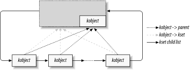

### 14.1. Kobjects, Ksets, and Subsystems
kobject 是将设备模型结合在一起的基本结构。它最初被设想为一个简单的参考计数器，但随着时间的推移，它的职责不断增长，它的字段也不断增长。struct kobject 及其支持代码处理的任务现在包括：

**Reference counting of objects** :通常，当创建内核对象时，无法知道它会存在多久。跟踪此类对象生命周期的一种方法是通过引用计数。当内核中没有代码保存对给定对象的引用时，该对象已完成其使用寿命并且可以被删除。

**Sysfs representation** ：sysfs 中显示的每个对象在其下面都有一个 kobject，它与内核交互以创建其可见表示。

**Data structure glue** ：整个设备模型是一个极其复杂的数据结构，由多个层次结构组成，它们之间有许多链接。 kobject 实现了这个结构并将其组合在一起。

**Hotplug event handling** ：kobject 子系统处理事件的生成，通知用户空间有关系统上硬件的情况。


从前面的列表中，人们可能会得出这样的结论：kobject 是一种复杂的结构。一个是对的。然而，通过一次查看一件作品，可以理解这种结构及其工作原理。

### 14.1.1.对象基础知识
kobject 的类型为 struct kobject；它在 <linux/kobject.h> 中定义。该文件还包括与 kobject 相关的许多其他结构的声明，当然还有一长串用于操作它们的函数。

#### 14.1.1.1 嵌入kobject
在我们深入了解细节之前，值得花一些时间来了解 kobject 的使用方式。如果您回顾 kobject 处理的函数列表，您会发现它们都是代表其他对象执行的服务。换句话说，kobject 本身没有什么意义。它的存在只是为了将更高级别的对象绑定到设备模型中。

因此，内核代码很少（甚至未知）创建独立的 kobject；相反，kobject 用于控制对更大的、特定于域的对象的访问。为此，kobject 被嵌入到其他结构中。如果您习惯于用面向对象的术语来思考事物，那么 kobject 可以被视为一个顶级的抽象类，其他类都派生自该类。kobject 实现了一组功能，这些功能本身并不是特别有用，但在其他对象中却很有用。C 语言不允许直接表达继承，因此必须使用其他技术（例如将一种结构嵌入另一种结构）。

作为一个例子，让我们回顾一下我们在第 3 章中遇到的 struct cdev。该结构在 2.6.10 内核中找到，如下所示：

```c
struct cdev {
    struct kobject kobj;
    struct module *owner;
    struct file_operations *ops;
    struct list_head list;
    dev_t dev;
    unsigned int count;
};
```
正如我们所看到的，cdev 结构中嵌入了一个 kobject。如果您有这些结构之一，则只需使用 kobj 字段即可找到其嵌入的 kobject。然而，使用 kobject 的代码通常会遇到相反的问题：给定一个 struct kobject 指针，指向包含结构的指针是什么？您应该避免使用技巧（例如假设 kobject 位于结构的开头），而是使用 container_of 宏（在第 3.5.1 节中介绍）。因此，将指针转换为嵌入在 struct cdev 中的名为 kp 的 struct kobject 的方法是：
```c
struct cdev *device = container_of(kp, struct cdev, kobj);
```
程序员经常定义一个简单的宏来将 kobject 指针“反向转换”到包含类型。

#### 14.1.1.2 Kobject初始化
kobject 的关键功能之一是充当它所嵌入的对象的引用计数器。只要对该对象的引用存在，该对象（以及支持它的代码）就必须继续存在。用于操作 kobject 引用计数的低级函数是：
```c
struct kobject *kobject_get(struct kobject *kobj);
void kobject_put(struct kobject *kobj);
```
成功调用 kobject_get 会增加 kobject 的引用计数器并返回指向 kobject 的指针。然而，如果 kobject 已经在被销毁的过程中，则操作失败，并且 kobject_get 返回 NULL。必须始终测试此返回值，否则可能会导致不愉快的竞争条件。

当释放引用时，对 kobject_put 的调用会减少引用计数，并可能释放该对象。请记住，kobject_init 将引用计数设置为 1；因此，当您创建一个 kobject 时，您应该确保当不再需要该初始引用时进行相应的 kobject_put 调用。

请注意，在许多情况下，kobject 本身的引用计数可能不足以防止竞争条件。例如，kobject（及其包含结构）的存在很可能需要创建该 kobject 的模块的持续存在。当 kobject 仍在传递时卸载该模块是行不通的。这就是为什么我们上面看到的 cdev 结构包含一个 struct module 指针。struct cdev 的引用计数实现如下：
```c
struct kobject *cdev_get(struct cdev *p)
{
    struct module *owner = p->owner;
    struct kobject *kobj;

    if (owner && !try_module_get(owner))
        return NULL;
    kobj = kobject_get(&p->kobj);
    if (!kobj)
        module_put(owner);
    return kobj;
}
```
创建对 cdev 结构的引用还需要创建对拥有它的模块的引用。因此 cdev_get 使用 try_module_get 尝试增加该模块的使用计数。如果该操作成功，kobject_get 也会用于增加 kobject 的引用计数。当然，该操作可能会失败，因此代码会检查 kobject_get 的返回值，并在出现问题时释放其对模块的引用。

#### 14.1.1.4 释放函数和kobject类型
讨论中仍然遗漏的一件重要事情是当 kobject 的引用计数达到 0 时会发生什么。创建 kobject 的代码通常不知道什么时候会发生；如果确实如此，那么首先使用引用计数就没有意义了。当引入 sysfs 时，即使是可预测的对象生命周期也会变得更加复杂；用户空间程序可以在任意时间段内保留对 kobject 的引用（通过保持其关联的 sysfs 文件之一打开）。

最终结果是，受 kobject 保护的结构无法在驱动程序生命周期中的任何单个、可预测点处释放，但在必须准备好在 kobject 的引用计数变为 0 的任何时刻运行的代码中释放。最终结果是，受 kobject 保护的结构无法在驱动程序生命周期中的任何单个、可预测点处释放，但在必须准备好在 kobject 的引用计数变为 0 的任何时刻运行的代码中释放。引用计数不受创建 kobject 的代码的直接控制。因此，只要对其 kobject 之一的最后一个引用消失，就必须异步通知该代码。

该通知是通过 kobject 的 release 方法完成的。通常，该方法的形式如下：
```c
void my_object_release(struct kobject *kobj)
{
    struct my_object *mine = container_of(kobj, struct my_object, kobj);

    /* Perform any additional cleanup on this object, then... */
    kfree(mine);
}
```
重要的一点怎么强调都不为过：每个 kobject 都必须有一个release方法，并且 kobject 必须持续存在（处于一致的状态）直到该方法被调用。如果不满足这些约束，则代码就有缺陷。它存在在对象仍在使用时释放该对象的风险，或者在返回最后一个引用后无法释放该对象的风险。

有趣的是，release方法并不存储在kobject本身中；相反，它与包含 kobject 的结构的类型相关联。该类型通过 struct kobj_type 类型的结构进行跟踪，通常简称为“ktype”。该结构如下所示：
```c
struct kobj_type {
    void (*release)(struct kobject *);
    struct sysfs_ops *sysfs_ops;
    struct attribute **default_attrs;
};
```
当然，struct kobj_type 中的release字段是指向该类型kobject的release方法的指针。我们将在本章稍后讨论其他两个字段（sysfs_ops 和 default_attrs）。

每个 kobject 都需要有一个关联的 kobj_type 结构。令人困惑的是，可以在两个不同的地方找到指向该结构的指针。kobject 结构本身包含一个可以包含此指针的字段（称为 ktype）。然而，如果该 kobject 是 kset 的成员，则 kobj_type 指针将由该 kset 提供。 （我们将在下一节中讨论 kset。）同时，宏：

```c
struct kobj_type *get_ktype(struct kobject *kobj);
```
查找给定 kobject 的 kobj_type 指针。

### 14.1.2. Kobject 层次结构、Kset 和子系统
kobject 是将设备模型结合在一起的基本结构。它最初被设想为一个简单的参考计数器，但随着时间的推移，它的职责不断增长，它的字段也不断增长。struct kobject 及其支持代码处理的任务现在包括：

**Reference counting of objects** : 通常，当创建内核对象时，无法知道它会存在多久。跟踪此类对象生命周期的一种方法是通过引用计数。当内核中没有代码保存对给定对象的引用时，该对象已完成其使用寿命并且可以被删除。

**Sysfs representation** :sysfs 中显示的每个对象在其下面都有一个 kobject，它与内核交互以创建其可见表示。

**Data structure glue** :整个设备模型是一个极其复杂的数据结构，由多个层次结构组成，它们之间有许多链接。 kobject 实现了这个结构并将其组合在一起。

**Hotplug event handling** ： kobject 子系统处理事件的生成，通知用户空间有关系统上硬件的情况。

从前面的列表中，人们可能会得出这样的结论：kobject 是一种复杂的结构。有一点。通过一次查看一个示例，可以理解这种结构及其工作原理。


### 14.1.1.对象基础知识
kobject 的类型为 struct kobject；它在 <linux/kobject.h> 中定义。该文件还包括与 kobject 相关的许多其他结构的声明，当然还有一长串用于操作它们的函数。

#### 14.1.1.1 嵌入kobject
在我们深入了解细节之前，值得花一些时间来了解 kobject 的使用方式。如果您回顾 kobject 处理的函数列表，您会发现它们都是代表其他对象执行的服务。换句话说，kobject 本身没有什么意义。它的存在只是为了将更高级别的对象绑定到设备模型中。

因此，内核代码很少（甚至未知）创建独立的 kobject；相反，kobject 用于控制对更大的、特定于域的对象的访问。为此，kobject 被嵌入到其他结构中。如果您习惯于用面向对象的术语来思考事物，那么 kobject 可以被视为一个顶级的抽象类，其他类都派生自该类。kobject 实现了一组功能，这些功能本身并不是特别有用，但在其他对象中却很有用。C 语言不允许直接表达继承，因此必须使用其他技术（例如将一种结构嵌入另一种结构）。

作为一个例子，让我们回顾一下我们在第 3 章中遇到的 struct cdev。该结构在 2.6.10 内核中找到，如下所示：

```c
struct cdev {
    struct kobject kobj;
    struct module *owner;
    struct file_operations *ops;
    struct list_head list;
    dev_t dev;
    unsigned int count;
};
```
正如我们所看到的，cdev 结构中嵌入了一个 kobject。如果您有这些结构之一，则只需使用 kobj 字段即可找到其嵌入的 kobject。然而，使用 kobject 的代码通常会遇到相反的问题：给定一个 struct kobject 指针，指向包含结构的指针是什么？您应该避免使用技巧（例如假设 kobject 位于结构的开头），相反，使用container_of宏（在第3.5.1节中介绍）。因此，将指针转换为嵌入在struct cdev中的名为kp的struct kobject的方法是：
```c
struct cdev *device = container_of(kp, struct cdev, kobj);
```
程序员经常定义一个简单的宏来将 kobject 指针“反向转换”到包含类型。

#### 14.1.1.2 Kobject初始化
本书介绍了许多具有简单机制的类型，用于在编译或运行时进行初始化。kobject 的初始化有点复杂，特别是当它的所有函数都被使用时。然而，无论如何使用 kobject，都必须执行几个步骤。

第一个是简单地将整个 kobject 设置为 0，通常是调用 memset。通常，这种初始化是作为 kobject 嵌入到的结构清零的一部分而发生的。未能将 kobject 归零通常会导致后续非常奇怪的崩溃；这不是您想要跳过的步骤。

下一步是通过调用 kobject_init() 来设置一些内部字段：
```c
void kobject_init(struct kobject *kobj);
```

其中，kobject_init 将 kobject 的引用计数设置为 1。然而，调用 kobject_init 还不够。Kobject 用户至少必须设置 kobject 的名称；这是 sysfs 条目中使用的名称。如果您深入研究内核源代码，您可以找到将字符串直接复制到 kobject 的名称字段中的代码，但应该避免这种方法。相反，使用：
```c
int kobject_set_name(struct kobject *kobj, const char *format, ...);
```
该函数采用 printk 样式的变量参数列表。不管你相信与否，这个操作实际上有可能失败（它可能会尝试分配内存）；认真的代码应该检查返回值并做出相应的反应。

应该由创建者直接或间接设置的其他 kobject 字段是 ktype、kset 和parent。我们将在本章稍后讨论这些内容。

#### 14.1.1.3 引用计数操作
kobject 的关键功能之一是充当它所嵌入的对象的引用计数器。只要对该对象的引用存在，该对象（以及支持它的代码）就必须继续存在。用于操作 kobject 引用计数的低级函数是：

```c
struct kobject *kobject_get(struct kobject *kobj);
void kobject_put(struct kobject *kobj);
```
成功调用 kobject_get 会增加 kobject 的引用计数器并返回指向 kobject 的指针。然而，如果 kobject 已经在被销毁的过程中，则操作失败，并且 kobject_get 返回 NULL。必须始终测试此返回值，否则可能会导致不愉快的竞争条件。

当释放引用时，对 kobject_put 的调用会减少引用计数，并可能释放该对象。请记住，kobject_init 将引用计数设置为 1；因此，当您创建一个 kobject 时，您应该确保当不再需要该初始引用时进行相应的 kobject_put 调用。

    
请注意，在许多情况下，kobject 本身的引用计数可能不足以防止竞争条件。例如，kobject（及其包含结构）的存在很可能需要创建该 kobject 的模块的持续存在。当 kobject 仍在传递时卸载该模块是行不通的。这就是为什么我们上面看到的 cdev 结构包含一个 struct module 指针。struct cdev 的引用计数实现如下：
```c
struct kobject *cdev_get(struct cdev *p)
{
    struct module *owner = p->owner;
    struct kobject *kobj;

    if (owner && !try_module_get(owner))
        return NULL;
    kobj = kobject_get(&p->kobj);
    if (!kobj)
        module_put(owner);
    return kobj;
}
```
创建对 cdev 结构的引用还需要创建对拥有它的模块的引用。因此 cdev_get 使用 try_module_get 尝试增加该模块的使用计数。如果该操作成功，kobject_get 也会用于增加 kobject 的引用计数。当然，该操作可能会失败，因此代码会检查 kobject_get 的返回值，并在出现问题时释放其对模块的引用。

#### 14.1.1.4 释放函数和kobject类型
讨论中仍然遗漏的一件重要事情是当 kobject 的引用计数达到 0 时会发生什么。创建 kobject 的代码通常不知道什么时候会发生；如果确实如此，那么首先使用引用计数就没有意义了。当引入 sysfs 时，即使是可预测的对象生命周期也会变得更加复杂；用户空间程序可以在任意时间段内保留对 kobject 的引用（通过保持其关联的 sysfs 文件之一打开）。

最终结果是，受 kobject 保护的结构无法在驱动程序生命周期中的任何单个、可预测点处释放，但在必须准备好在 kobject 的引用计数变为 0 的任何时刻运行的代码中释放。引用计数不受创建 kobject 的代码的直接控制。因此，只要对其 kobject 之一的最后一个引用消失，就必须异步通知该代码。

该通知是通过 kobject 的 release 方法完成的。通常，该方法的形式如下：
```c
void my_object_release(struct kobject *kobj)
{
    struct my_object *mine = container_of(kobj, struct my_object, kobj);

    /* Perform any additional cleanup on this object, then... */
    kfree(mine);
}
```
重要的一点怎么强调都不为过：每个 kobject 都必须有一个release方法，并且 kobject 必须持续存在（处于一致的状态）直到该方法被调用。如果不满足这些约束，则代码就有缺陷。它存在在对象仍在使用时释放该对象的风险，或者在返回最后一个引用后无法释放该对象的风险。

有趣的是，release方法并不存储在kobject本身中；相反，它与包含 kobject 的结构的类型相关联。该类型通过 struct kobj_type 类型的结构进行跟踪，通常简称为“ktype”。该结构如下所示：
```c
struct kobj_type {
    void (*release)(struct kobject *);
    struct sysfs_ops *sysfs_ops;
    struct attribute **default_attrs;
};
```
当然，struct kobj_type 中的release字段是指向该类型kobject的release方法的指针。我们将在本章稍后讨论其他两个字段（sysfs_ops 和 default_attrs）。

每个 kobject 都需要有一个关联的 kobj_type 结构。令人困惑的是，可以在两个不同的地方找到指向该结构的指针。kobject 结构本身包含一个可以包含此指针的字段（称为 ktype）。然而，如果该 kobject 是 kset 的成员，则 kobj_type 指针将由该 kset 提供。 （我们将在下一节中讨论 kset。）同时，宏：
```c
struct kobj_type *get_ktype(struct kobject *kobj);
```
查找给定 kobject 的 kobj_type 指针。

### 14.1.2. Kobject 层次结构、Kset 和子系统
kobject 结构通常用于将对象链接在一起形成与正在建模的子系统的结构相匹配的层次结构。这种链接有两种独立的机制：父指针和 kset。

struct kobject 中的父字段是指向另一个 kobject 的指针，该 kobject 代表层次结构中的下一层。例如，如果 kobject 代表 USB 设备，则其父指针可以指示代表该设备所插入的集线器的对象。

父指针的主要用途是在 sysfs 层次结构中定位对象。我们将在 14.2 节中看到它是如何工作的。

#### 14.1.2.1 Ksets
在许多方面，kset 看起来像是 kobj_type 结构的扩展；kset 是嵌入在相同类型的结构中的 kobject 的集合。然而，struct kobj_type 关注对象的类型，而 struct kset 关注聚合和集合。这两个概念已被分开，以便相同类型的对象可以出现在不同的集合中。

因此，kset的主要功能是包含；它可以被认为是 kobject 的顶级容器类。事实上，每个 kset 内部都包含自己的 kobject，并且在很多方面都可以将其视为 kobject。值得注意的是，kset 总是在 sysfs 中表示；一旦一个 kset 被设置并添加到系统中，就会有一个 sysfs 目录。Kobject 不一定出现在 sysfs 中，但作为 kset 成员的每个 kobject 都在那里表示。

将 kobject 添加到 kset 通常是在创建对象时完成的；这是一个两步过程。kobject的kset字段必须指向感兴趣的kset；那么 kobject 应该传递给：
```c
int kobject_add(struct kobject *kobj);
```
与往常一样，程序员应该意识到该函数可能会失败（在这种情况下它会返回负错误代码）并做出相应的响应。内核提供了一个方便的函数：
```c
extern int kobject_register(struct kobject *kobj);
```
这个函数只是kobject_init 和kobject_add 的组合。

当一个 kobject 被传递给 kobject_add 时，它的引用计数就会增加。毕竟，kset 中的包含是对对象的引用。在某些时候，kobject 可能必须从 kset 中删除才能清除该引用；这是通过以下方式完成的：
```c
void kobject_del(struct kobject *kobj);
```
还有一个kobject_unregister函数，它是kobject_del和kobject_put的组合。

kset 将其子项保存在标准内核链表中。在几乎所有情况下，所包含的 kobject 在其父级字段中也有指向 kset（或者严格地说，其嵌入的 kobject）的指针。因此，通常情况下，kset 及其 kobject 看起来类似于图 14-1 所示。请记住：

- 图中包含的所有 kobject 实际上都嵌入在其他类型中，甚至可能是其他 kset 中。
- 并不要求 kobject 的父级是包含 kset（尽管任何其他组织都会很奇怪且罕见）。



#### 14.1.2.2 kset 上的操作
对于初始化和设置，kset 具有与 kobject 非常相似的接口。存在以下功能：

```c
void kset_init(struct kset *kset);
int kset_add(struct kset *kset);
int kset_register(struct kset *kset);
void kset_unregister(struct kset *kset);
```

大多数情况下，这些函数只是在 kset 的嵌入 kobject 上调用类似的 kobject_ 函数。

管理ksets的引用计数，情况大致相同：

```c
struct kset *kset_get(struct kset *kset);
void kset_put(struct kset *kset);
```
kset 还有一个名称，存储在嵌入的 kobject 中。因此，如果您有一个名为 my_set 的 kset，则可以使用以下命令设置其名称：
```c
kobject_set_name(&my_set->kobj, "The name");
```
Ksets 还有一个指向 kobj_type 结构的指针（在 ktype 字段中），描述它所包含的 kobject。该类型优先于 kobject 本身中的 ktype 字段使用。因此，在典型用法中，struct kobject 中的 ktype 字段保留为 NULL，因为 kset 中的同一字段是实际使用的字段。

最后，kset 包含子系统指针（称为 subsys）。现在是时候讨论子系统了。

#### 14.1.2.3 子系统
子系统是整个内核的高级部分的表示。子系统通常（但并非总是）出现在 sysfs 层次结构的顶部。内核中的一些示例子系统包括 block_subsys（/sys/block，用于块设备）、devices_subsys（/sys/devices，核心设备层次结构）以及内核已知的每种总线类型的特定子系统。驱动程序作者几乎不需要创建新的子系统；如果您想这样做，请再考虑一下。最后，您可能想要的是添加一个新类，如第 14.5 节中所讨论的。

子系统由一个简单的结构表示：
```c
struct subsystem {
    struct kset kset;
    struct rw_semaphore rwsem;
};
```
因此，子系统实际上只是一个 kset 的包装器，其中包含一个信号量。

每个 kset 必须属于一个子系统。子系统成员资格有助于建立 kset 在层次结构中的位置，但更重要的是，子系统的 rwsem 信号量用于序列化对 kset 内部链表的访问。该成员资格由 struct kset 中的 subsys 指针表示。这样，我们可以从kset的结构中找到每个kset包含的子系统，但无法直接从子系统结构中找到子系统中包含的多个kset。

子系统通常用特殊的宏来声明：
```c
decl_subsys(name, struct kobj_type *type, struct kset_hotplug_ops *hotplug_ops);
```
该宏创建一个 struct  subsystem，其名称是通过为宏指定的名称并将 _subsys 附加到其上而形成的。该宏还使用给定类型和 hotplug_ops 初始化内部 kset。（我们将在本章后面讨论热插拔操作。）

子系统具有通常的设置和拆卸功能列表：

```c
void subsystem_init(struct subsystem *subsys);
int subsystem_register(struct subsystem *subsys);
void subsystem_unregister(struct subsystem *subsys);
struct subsystem *subsys_get(struct subsystem *subsys)
void subsys_put(struct subsystem *subsys);
```
大多数这些操作仅作用于子系统的 kset。