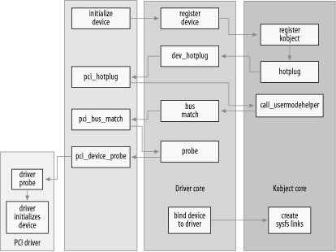

## 14.6 把它们放在一起
为了更好地理解驱动程序模型的作用，让我们逐步了解内核中设备生命周期的步骤。我们描述 PCI 子系统如何与驱动程序模型交互、如何添加和删除驱动程序的基本概念以及如何在系统中添加和删除设备。这些细节在具体描述 PCI 内核代码的同时，也适用于使用驱动程序核心来管理其驱动程序和设备的所有其他子系统。

PCI 内核、驱动程序内核和各个 PCI 驱动程序之间的交互相当复杂，如图 14-2 所示。




### 14.6.1. Add a Device
PCI 子系统声明一个名为 pci_bus_type 的结构体bus_type，它使用以下值进行初始化：
```c
struct bus_type pci_bus_type = {
    .name      = "pci",
    .match     = pci_bus_match,
    .hotplug   = pci_hotplug,
    .suspend   = pci_device_suspend,
    .resume    = pci_device_resume,
    .dev_attrs = pci_dev_attrs,
};
```
当通过调用bus_register 将 PCI 子系统加载到内核中时，此 pci_bus_type 变量会在驱动程序内核中注册。当发生这种情况时，驱动程序核心会在 /sys/bus/pci 中创建一个 sysfs 目录，其中包含两个目录：devices 和 drivers。

所有 PCI 驱动程序都必须定义一个 struct pci_driver 变量，该变量定义该 PCI 驱动程序可以执行的不同功能（有关 PCI 子系统以及如何编写 PCI 驱动程序的更多信息，请参阅第 12 章）。该结构包含一个 struct device_driver，然后在注册 PCI 驱动程序时由 PCI 内核初始化：

```c
/* initialize common driver fields */
drv->driver.name = drv->name;
drv->driver.bus = &pci_bus_type;
drv->driver.probe = pci_device_probe;
drv->driver.remove = pci_device_remove;
drv->driver.kobj.ktype = &pci_driver_kobj_type;
```
此代码为驱动程序设置总线以指向 pci_bus_type，并将探测和删除函数指向 PCI 内核内的函数。驱动程序 kobject 的 ktype 设置为变量 pci_driver_kobj_type，以便 PCI 驱动程序的属性文件正常工作。然后PCI核心向驱动核心注册PCI驱动：
```c
/* register with core */
error = driver_register(&drv->driver);
```
该驱动程序现在已准备好绑定到它支持的任何 PCI 设备。

PCI 内核在实际与 PCI 总线通信的特定于体系结构的代码的帮助下，开始探测 PCI 地址空间，寻找所有 PCI 设备。当找到 PCI 设备时，PCI 核心会在内存中创建一个 struct pci_dev 类型的新变量。struct pci_dev 结构的一部分如下所示：
```c
struct pci_dev {
    /* ... */
    unsigned int   devfn;
    unsigned short vendor;
    unsigned short device;
    unsigned short subsystem_vendor;
    unsigned short subsystem_device;
    unsigned int   class;
    /* ... */
    struct pci_driver *driver;
    /* ... */
    struct device dev;
    /* ... */
};
```
该 PCI 设备的总线特定字段由 PCI 核心初始化（devfn、vendor、device 和其他字段），并且 struct device 变量的父变量设置为该 PCI 设备所在的 PCI 总线设备。总线变量设置为指向 pci_bus_type 结构。然后根据从 PCI 设备读取的名称和 ID 设置 name 和bus_id 变量。

PCI 设备结构初始化后，设备通过调用以下命令向驱动程序核心注册：
```c
device_register(&dev->dev);
```
在 device_register 函数中，驱动程序核心初始化了许多设备的字段，将设备的 kobject 注册到 kobject 核心（这会导致生成热插拔事件，但我们将在本章后面讨论），然后将设备添加到设备的父设备持有的设备列表。这样做是为了让所有设备都可以按正确的顺序遍历，并且始终知道每个设备位于设备层次结构中的位置。

然后将该设备添加到所有设备的总线特定列表中，在本例中为 pci_bus_type 列表。然后遍历在总线上注册的所有驱动程序的列表，并为每个驱动程序调用总线的匹配函数，指定该设备。对于pci_bus_type总线，在设备提交给驱动核心之前，匹配函数被PCI核心设置为指向pci_bus_match函数。

pci_bus_match 函数将驱动程序核心传递给它的 struct device 转换回 struct pci_dev。它还将 struct device_driver 转换回 struct pci_driver，然后查看设备和驱动程序的 PCI 设备特定信息，以查看驱动程序是否声明它可以支持此类设备。如果匹配不成功，该函数将 0 返回给驱动程序核心，并且驱动程序核心将移至其列表中的下一个驱动程序。

如果匹配成功，函数返回1给驱动核心。这会导致驱动程序核心将struct device中的驱动程序指针设置为指向该驱动程序，然后调用struct device_driver中指定的探测函数。

早些时候，在 PCI 驱动程序注册到驱动程序核心之前，probe 变量被设置为指向 pci_device_probe 函数。该函数将 struct device 强制转换回 struct pci_dev，并将设备中设置的 struct driver 强制转换回 struct pci_driver。它再次验证该驱动程序是否声明它可以支持该设备（这似乎是出于某种未知原因的冗余额外检查），增加设备的引用计数，然后使用指向该结构的指针调用 PCI 驱动程序的探测函数它应该绑定到的 pci_dev 结构。

如果 PCI 驱动程序的探测函数确定由于某种原因它无法处理该设备，它会返回一个负错误值，该错误值会传播回驱动程序核心，并导致它继续查找驱动程序列表以与该设备相匹配。设备。如果探测函数可以声明该设备，它会执行正确处理该设备所需的所有初始化，然后将 0 返回到驱动程序核心。这会导致驱动程序核心将该设备添加到当前由该特定驱动程序绑定的所有设备的列表中，并在 sysfs 中的驱动程序目录中创建一个符号链接到它现在控制的设备。此符号链接允许用户准确查看哪些设备绑定到哪些设备。这可以看作：

```
$ tree /sys/bus/pci
/sys/bus/pci/
|-- devices
|   |-- 0000:00:00.0 -> ../../../devices/pci0000:00/0000:00:00.0
|   |-- 0000:00:00.1 -> ../../../devices/pci0000:00/0000:00:00.1
|   |-- 0000:00:00.2 -> ../../../devices/pci0000:00/0000:00:00.2
|   |-- 0000:00:02.0 -> ../../../devices/pci0000:00/0000:00:02.0
|   |-- 0000:00:04.0 -> ../../../devices/pci0000:00/0000:00:04.0
|   |-- 0000:00:06.0 -> ../../../devices/pci0000:00/0000:00:06.0
|   |-- 0000:00:07.0 -> ../../../devices/pci0000:00/0000:00:07.0
|   |-- 0000:00:09.0 -> ../../../devices/pci0000:00/0000:00:09.0
|   |-- 0000:00:09.1 -> ../../../devices/pci0000:00/0000:00:09.1
|   |-- 0000:00:09.2 -> ../../../devices/pci0000:00/0000:00:09.2
|   |-- 0000:00:0c.0 -> ../../../devices/pci0000:00/0000:00:0c.0
|   |-- 0000:00:0f.0 -> ../../../devices/pci0000:00/0000:00:0f.0
|   |-- 0000:00:10.0 -> ../../../devices/pci0000:00/0000:00:10.0
|   |-- 0000:00:12.0 -> ../../../devices/pci0000:00/0000:00:12.0
|   |-- 0000:00:13.0 -> ../../../devices/pci0000:00/0000:00:13.0
|   `-- 0000:00:14.0 -> ../../../devices/pci0000:00/0000:00:14.0
`-- drivers
    |-- ALI15x3_IDE
    |   `-- 0000:00:0f.0 -> ../../../../devices/pci0000:00/0000:00:0f.0
    |-- ehci_hcd
    |   `-- 0000:00:09.2 -> ../../../../devices/pci0000:00/0000:00:09.2
    |-- ohci_hcd
    |   |-- 0000:00:02.0 -> ../../../../devices/pci0000:00/0000:00:02.0
    |   |-- 0000:00:09.0 -> ../../../../devices/pci0000:00/0000:00:09.0
    |   `-- 0000:00:09.1 -> ../../../../devices/pci0000:00/0000:00:09.1
    |-- orinoco_pci
    |   `-- 0000:00:12.0 -> ../../../../devices/pci0000:00/0000:00:12.0
    |-- radeonfb
    |   `-- 0000:00:14.0 -> ../../../../devices/pci0000:00/0000:00:14.0
    |-- serial
    `-- trident
        `-- 0000:00:04.0 -> ../../../../devices/pci0000:00/0000:00:04

.0
```
### 14.6.2 删除设备
PCI 设备可以通过多种不同的方式从系统中删除。所有 CardBus 设备实际上都是具有不同物理外形的 PCI 设备，并且内核 PCI 核心并不区分它们。允许在机器仍在运行时移除或添加 PCI 设备的系统变得越来越流行，并且 Linux 支持它们。还有一个假的 PCI Hotplug 驱动程序，允许开发人员测试其 PCI 驱动程序是否可以在系统运行时正确处理设备的删除。该模块称为 fakephp，使内核认为 PCI 设备已消失，但它不允许用户从没有适当硬件的系统中物理删除 PCI 设备。有关如何使用该驱动程序测试 PCI 驱动程序的更多信息，请参阅该驱动程序的文档。

PCI 核心删除设备所花费的精力比添加设备少得多。当要删除 PCI 设备时，将调用 pci_remove_bus_device 函数。该函数执行一些特定于 PCI 的清理和内务处理，然后使用指向 struct pci_dev 的 struct device 成员的指针调用 device_unregister 函数。

在 device_unregister 函数中，驱动程序核心仅取消 sysfs 文件与绑定到设备（如果有）的驱动程序的链接，从其内部设备列表中删除该设备，并使用指向所包含的 struct kobject 的指针调用 kobject_del在 struct device 结构中。该函数对用户空间进行热插拔调用，表明该 kobject 现在已从系统中删除，然后删除与该 kobject 关联的所有 sysfs 文件以及该 kobject 最初创建的 sysfs 目录本身。

kobject_del 函数还删除设备本身的 kobject 引用。如果该引用是最后一个（意味着没有为设备的 sysfs 条目打开用户空间文件），则调用 PCI 设备本身的释放函数 pci_release_dev。该函数只是释放 struct pci_dev 占用的内存。

此后，与该设备关联的所有 sysfs 条目都将被删除，并且与该设备关联的内存将被释放。PCI 设备现已从系统中完全删除。

### 14.6.3 添加驱动程序
当调用 pci_register_driver 函数时，PCI 驱动程序被添加到 PCI 内核。该函数仅初始化 struct pci_driver 结构中包含的 struct device_driver 结构，如前面有关添加设备的部分中所述。然后PCI核心用指向struct pci_driver结构中包含的structdevice_driver结构的指针调用驱动核心中的driver_register函数。

driver_register函数初始化struct device_driver结构中的几个锁，然后调用bus_add_driver函数。该函数执行以下步骤：

- 查找与驱动程序关联的总线。如果没有找到该总线，该函数立即返回。
- 驱动程序的 sysfs 目录是根据驱动程序的名称及其关联的总线创建的。
- 获取总线的内部锁，然后遍历所有已在总线上注册的设备，并为它们调用匹配函数，就像添加新设备时一样。如果该匹配函数成功，则会发生其余的绑定过程，如上一节所述。

### 14.6.4 删除驱动程序
删除驱动程序是一个非常简单的操作。对于 PCI 驱动程序，驱动程序调用 pci_unregister_driver 函数。  该函数仅调用驱动程序核心函数 driver_unregister，并将指向 struct pci_driver 结构的 struct device_driver 部分的指针传递给它。

driver_unregister 函数通过清理附加到 sysfs 树中驱动程序条目的一些 sysfs 属性来处理一些基本的内务处理。然后它迭代连接到该驱动程序的所有设备并为其调用释放函数。这与前面提到的当设备从系统中删除时的释放函数完全相同。

所有设备与驱动程序解除绑定后，驱动程序代码执行以下独特的逻辑： 

```c
down(&drv->unload_sem);
up(&drv->unload_sem);
```
这是在返回函数调用者之前完成的。之所以会获取此锁，是因为代码需要等待此驱动程序上的所有引用计数都降至 0 后才能安全返回。这是必需的，因为 driver_unregister 函数最常被调用作为正在卸载的模块的退出路径。只要设备引用驱动程序，该模块就需要保留在内存中，并且通过等待此锁被释放，这使内核知道何时可以安全地从内存中删除驱动程序。
