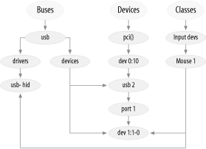

## 第 14 章 Linux 设备模型
2.5 开发周期的既定目标之一是为内核创建统一的设备模型。以前的内核没有单一的数据结构可以用来获取有关系统如何组合在一起的信息。尽管缺乏信息，但在一段时间内一切进展顺利。然而，新系统的需求及其更复杂的拓扑结构以及支持电源管理等功能的需求清楚地表明，需要一个描述系统结构的通用抽象。

2.6 设备模型提供了这种抽象。它现在在内核中使用来支持各种任务，包括：

<i>电源管理和系统关闭</i>

这些需要了解系统的结构。例如，在处理连接到该适配器的所有设备之前，不能关闭 USB 主机适配器。设备模型使得能够以正确的顺序遍历系统的硬件。

<i>与用户空间的通信</i>

sysfs 虚拟文件系统的实现与设备模型紧密相关，并公开其所表示的结构。向用户空间和用于更改操作参数的旋钮提供有关系统的信息越来越多地通过 sysfs 完成，因此也通过设备模型完成。

<i>热插拔设备</i>

计算机硬件变得越来越动态；外围设备可以根据用户的喜好来来去去。内核中用于处理设备插入和拔出以及（特别是）与用户空间进行通信的热插拔机制是通过设备模型进行管理的。

<i>设备类</i>

系统的许多部分对设备如何连接没有多大兴趣，但它们需要知道有哪些类型的设备可用。设备模型包括一种将设备分配给类的机制，这些类在更高的功能级别上描述这些设备，并允许从用户空间发现它们。

<i>对象生命周期</i>

上面描述的许多功能，包括热插拔支持和 sysfs，使内核中创建的对象的创建和操作变得复杂。设备模型的实现需要创建一组机制来处理对象生命周期、它们之间的关系以及它们在用户空间中的表示。

Linux设备模型是一个复杂的数据结构。例如，考虑第 14 章，它（以简化形式）显示了与 USB 鼠标相关的设备模型结构的一小部分。在图的中心，我们看到核心“设备”树的一部分，它显示了鼠标如何连接到系统。“总线”树跟踪连接到每条总线的内容，而“类”下的子树则关注设备提供的功能，无论它们如何连接。即使是一个简单的系统上的设备模型树也包含数百个节点，如图所示；这是一个很难从整体上可视化的数据结构。

大多数情况下，Linux 设备模型代码会考虑所有这些注意事项，而不会将其强加给驱动程序作者。它大部分位于背景中；与设备模型的直接交互通常由总线级逻辑和各种其他内核子系统处理。因此，许多驱动程序作者可以完全忽略设备模型，并相信它会自行处理。

然而，有时了解设备模型是一件好事。有时设备模型会从其他层后面“泄漏”；例如，通用 DMA 代码（我们在第 15 章中遇到）适用于 struct device。您可能想要使用设备模型提供的一些功能，例如 kobjects 提供的引用计数和相关功能。通过sysfs与用户空间通信也是一个设备模型函数；本章解释了这种沟通是如何进行的。

然而，我们从自下而上地介绍设备模型开始。设备模型的复杂性使得从高层视图开始很难理解。我们希望，通过展示低级设备组件的工作原理，我们可以帮助您做好准备，应对掌握如何使用这些组件构建更大结构的挑战。

对于许多读者来说，本章可以视为高级材料，无需第一次通读。不过，当我们深入了解底层细节时，我们鼓励那些对 Linux 设备模型如何工作感兴趣的人继续前进。