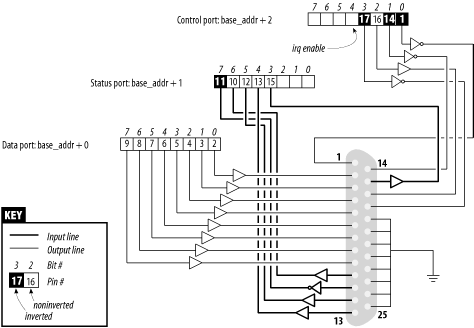

##  9.3. I/O 端口示例
我们用来显示设备驱动程序中的端口 I/O 的示例代码作用于通用数字 I/O 端口；大多数计算机系统中都可以找到此类端口。

数字 I/O 端口最常见的形式是字节宽的 I/O 位置，可以是内存映射的，也可以是端口映射的。当您将值写入输出位置时，输出引脚上看到的电信号会根据写入的各个位而变化。当您从输入位置读取值时，输入引脚上看到的当前逻辑电平将作为单独的位值返回。

此类 I/O 端口的实际实现和软件接口因系统而异。大多数时候，I/O 引脚由两个 I/O 位置控制：一个位置允许选择哪些引脚用作输入和哪些引脚用作输出，另一个位置可以实际读取或写入逻辑电平。然而，有时事情甚至更简单，这些位被硬连线为输入或输出（但在这种情况下，它们不再称为“通用 I/O”）；所有个人计算机上的并行端口就是这样一种不那么通用的 I/O 端口。无论哪种方式，I/O 引脚都可以通过我们稍后介绍的示例代码使用。

### 9.3.1.并行端口概述
因为我们预计大多数读者会使用称为“个人计算机”形式的 x86 平台，所以我们认为有必要解释一下 PC 并行端口的设计方式。尽管大多数读者可能都有可用的并行端口规范，但为了您的方便，我们在这里总结了它们。

并行接口的最小配置（我们忽略 ECP 和 EPP 模式）由三个 8 位端口组成。PC 标准第一个并行接口的 I/O 端口从 0x378 开始，第二个并行接口的 I/O 端口从 0x278 开始。第一个端口是双向数据寄存器；它直接连接到物理连接器上的引脚 2-9。第二个端口是只读状态寄存器；当并行端口用于打印机时，该寄存器报告打印机状态的多个方面，例如在线、缺纸或忙碌。第三个端口是仅输出控制寄存器，除其他外，它控制是否启用中断。

并行通信中使用的信号电平是标准晶体管-晶体管逻辑 (TTL) 电平：0 伏和 5 伏，逻辑阈值约为 1.2 伏。尽管大多数现代并行端口在电流和电压额定值方面都做得更好，但您可以信赖这些端口至少满足标准 TTL LS 电流额定值。

> 并行连接器未与计算机的内部电路隔离，如果您想将逻辑门直接连接到端口，这非常有用。但一定要注意正确接线；当您使用自己的定制电路时，并行端口电路很容易损坏，除非您在电路中添加光隔离器。如果您担心会损坏主板，则可以选择使用插入式并行端口。

位规格如图 9-1 所示。您可以访问 12 个输出位和 5 个输入位，其中一些位在其信号路径过程中逻辑反转。唯一没有关联信号引脚的位是端口 2 的位 4 (0x10)，它允许来自并行端口的中断。我们在第 10 章中使用该位作为中断处理程序实现的一部分。



### 9.3.2.示例驱动程序
我们引入的驱动程序称为“short”（简单硬件操作和原始测试）。它所做的只是从您在加载时选择的端口开始读取和写入几个 8 位端口。默认情况下，它使用分配给 PC 并行接口的端口范围。每个设备节点（具有唯一的次要编号）访问不同的端口。short驱动器没有做任何有用的事情；它只是作为作用于端口的单个指令进行隔离以供外部使用。如果不习惯端口I/O，可以使用short来熟悉一下；您可以测量通过端口传输数据或玩其他游戏所需的时间。

为了让 Short 在您的系统上工作，它必须能够自由访问底层硬件设备（默认情况下是并行接口）；因此，没有其他驱动程序可以分配它。大多数现代发行版将并行端口驱动程序设置为仅在需要时加载的模块，因此 I/O 地址的争用通常不是问题。但是，如果您从 Short 中收到“无法获取 I/O 地址”错误（在控制台或系统日志文件中），则其他某些驱动程序可能已经占用了该端口。快速查看 /proc/ioports 通常会告诉您哪个驱动程序出现问题。如果您不使用并行接口，同样的注意事项也适用于其他 I/O 设备。

从现在起，我们仅提及“并行接口”以简化讨论。但是，您可以在加载时设置基本模块参数以将 Short 重定向到其他 I/O 设备。此功能允许示例代码在任何可以访问可通过 outb 和 inb 访问的数字 I/O 接口的 Linux 平台上运行（即使实际硬件在除 x86 之外的所有平台上都是内存映射的）。稍后，在第 9.4 节中，我们将展示如何将 Short 与通用内存映射数字 I/O 一起使用。

要观察并行连接器上发生的情况，并且如果您有点使用硬件的倾向，您可以将一些 LED 焊接到输出引脚上。每个 LED 应串联连接到一个通向接地引脚的 1-K 电阻器（当然，除非您的 LED 内置了该电阻器）。如果将输出引脚连接到输入引脚，您将生成自己的输入以从输入端口读取。

请注意，您不能仅将打印机连接到并行端口并看到发送到短路的数据。该驱动程序实现了对 I/O 端口的简单访问，并且不执行打印机操作数据所需的握手。在下一章中，我们将展示一个示例驱动程序（称为 Shortprint），它能够驱动并行打印机；然而，该驱动程序使用中断，因此我们还不能完全了解它。

如果您打算通过将 LED 焊接到 D 型连接器来查看并行数据，我们建议您不要使用引脚 9 和 10，因为我们稍后将它们连接在一起以运行第 10 章中所示的示例代码。

就short而言，/dev/short0向位于I/O地址基数的8位端口（0x378，除非在加载时更改）写入和读取。 /dev/short1 写入位于基址 + 1 的 8 位端口，依此类推，直到基址 + 7。

/dev/short0 执行的实际输出操作基于使用 outb 的紧密循环。内存屏障指令用于确保输出操作实际发生并且不会被优化掉：
```c
while (count--) {
    outb(*(ptr++), port);
    wmb(  );
}
```
您可以运行以下命令来点亮 LED：
```
echo  -n "any string"  > /dev/short0
```
每个 LED 监控输出端口的单个位。请记住，只有最后写入的字符在输出引脚上保持稳定的时间足以被您的眼睛感知。因此，我们建议您通过将 -n 选项传递给 echo 来防止自动插入尾随换行符。

读取是由类似的函数执行的，该函数围绕 inb 而不是 outb 构建。为了从并行端口读取“有意义”的值，您需要将一些硬件连接到连接器的输入引脚以生成信号。如果没有信号，您将读取无穷无尽的相同字节流。如果您选择从输出端口读取，您很可能会取回写入该端口的最后一个值（这适用于并行接口和大多数其他常用的数字 I/O 电路）。因此，那些不愿意拿出烙铁的人可以通过运行以下命令来读取端口 0x378 上的当前输出值：

```
dd if=/dev/short0 bs=1 count=1 | od -t x1
```
为了演示所有 I/O 指令的使用，每个短设备都有三种变体：/dev/short0 执行刚才所示的循环，/dev/short0p 使用 outb_p 和 inb_p 代替“快速”函数，以及 / dev/short0s 使用字符串指令。这样的设备有八个，从short0到short7。虽然 PC 并行接口只有三个端口，但如果使用不同的 I/O 设备来运行测试，您可能需要更多端口。

简短的驱动程序执行绝对最少的硬件控制，但足以显示如何使用 I/O 端口指令。有兴趣的读者可能想查看 parport 和 parport_pc 模块的源代码，了解该设备在现实生活中可以变得多么复杂，以支持并行端口上的一系列设备（打印机、磁带备份、网络接口）。